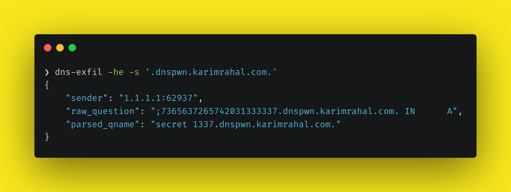
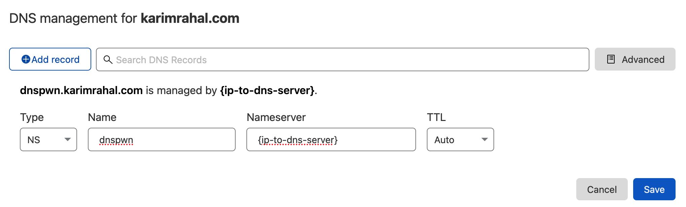

# dns-exfil

Run a DNS server for the purpose of logging DNS questions. Can be used for DNS exfiltration or for good-old DNS pingback detection.




## Usage

```
$ dns-exfil --help
usage: dns-exfil [-h] [-a HOST] [-p PORT] [-he] [-s SUFFIX]

Open a DNS server that knows no records but records every request. Used for DNS exfiltration.

optional arguments:
  -h, --help            show this help message and exit
  -a HOST, --address HOST
                        Server host (default: 127.0.0.1)
  -p PORT, --port PORT  Server port (default: 53)
  -he, --hex-encoded    Enable hex decoding
  -s SUFFIX, --suffix SUFFIX
                        Default FQDN suffix of DNS questions (recommended when DNS requests are hex encoded); example: '.evil.com.'
```

## How to install

```sh
$ git clone https://github.com/KarimPwnz/dns-exfil.git
$ python3 setup.py install
```

## DNS pingback set-up

1. Start your DNS server by running `dns-exfil`

2. Set-up the server as the `NS` for a domain

   

3. Send your target to `<whatever_you_want>.dns_exfil_domain`

## DNS exfiltration set-up

Same setup as for DNS pingback. To exfiltrate data through DNS, you'll probably want dns-exfil to accept hex-encoded data. You can enable that feature by passing the `--hex-encoded` (`-he`) flag; for more accurate parsing, specify the FQDN of your DNS exfiltration domain through the `--suffix` (`-s`) flag. Example: `dns-exfil -he -s '.dnspwn.karimrahal.com.'`. In case the DNS question does not contain hex encoded values, dns-exfil will still parse it correctly.
