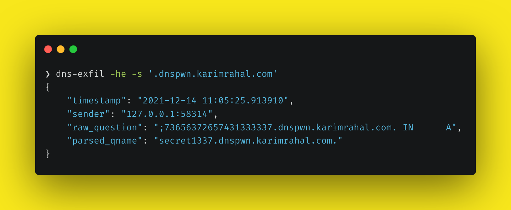

# dns-exfil

Run a DNS server for the purpose of logging DNS questions. Can be used for DNS exfiltration or for good-old DNS pingback detection.

<!-- https://carbon.now.sh/?bg=rgba%28248%2C231%2C28%2C1%29&t=seti&wt=none&l=application%2Fx-sh&ds=true&dsyoff=20px&dsblur=68px&wc=true&wa=true&pv=56px&ph=56px&ln=false&fl=1&fm=Fira+Code&fs=14px&lh=152%25&si=false&es=2x&wm=false&code=%25E2%259D%25AF%2520dns-exfil%2520-he%2520-s%2520%27.dnspwn.karimrahal.com%27%250A%257B%250A%2520%2520%2520%2520%2522timestamp%2522%253A%2520%25222021-12-14%252011%253A05%253A25.913910%2522%252C%250A%2520%2520%2520%2520%2522sender%2522%253A%2520%2522127.0.0.1%253A58314%2522%252C%250A%2520%2520%2520%2520%2522raw_question%2522%253A%2520%2522%253B73656372657431333337.dnspwn.karimrahal.com.%2520IN%2520%2520%2520%2520%2520%2520A%2522%252C%250A%2520%2520%2520%2520%2522parsed_qname%2522%253A%2520%2522secret1337.dnspwn.karimrahal.com.%2522%250A%257D -->




## Usage

```
$ dns-exfil --help
usage: dns-exfil [-h] [-a HOST] [-p PORT] [-he] [-s SUFFIX]

Open a DNS server that knows no records but records every request. Used for DNS exfiltration.

optional arguments:
  -h, --help            show this help message and exit
  -a HOST, --address HOST
                        Server host (default: 127.0.0.1)
  -p PORT, --port PORT  Server port (default: 53)
  -he, --hex-encoded    Enable hex decoding
  -s SUFFIX, --suffix SUFFIX
                        Default FQDN suffix of DNS questions (recommended when DNS requests are hex encoded); example: '.evil.com.'
```

## How to install

```
$ git clone https://github.com/KarimPwnz/dns-exfil.git
$ cd dns-exfil
$ python3 setup.py install
```

## DNS pingback set-up

1. Start your DNS server by running `dns-exfil`

2. Set-up the server as the `NS` for a domain

   

3. Send your target to `<whatever_you_want>.dns_exfil_domain`

## DNS exfiltration set-up

Same setup as for DNS pingback. To exfiltrate data through DNS, you'll probably want dns-exfil to decode hex-encoded data. You can enable that feature by passing the `--hex-encoded` (`-he`) flag into dns-exfil; for more accurate parsing, specify the FQDN of your DNS exfiltration domain through the `--suffix` (`-s`) flag. Example: `dns-exfil -he -s '.dnspwn.karimrahal.com.'`. In case the DNS question does not contain hex encoded values, dns-exfil will still parse it correctly.

## Output

Each output is in JSON format:

```json
{
    "timestamp": "2021-12-14 11:10:51.345230",
    "sender": "127.0.0.1:59482",
    "raw_question": ";73656372657431333337.dnspwn.karimrahal.com. IN      A",
    "parsed_qname": "secret1337.dnspwn.karimrahal.com."
}
{
    "timestamp": "2021-12-14 11:11:04.232967",
    "sender": "127.0.0.1:49211",
    "raw_question": ";hello.world.dnspwn.karimrahal.com. IN      A",
    "parsed_qname": "hello.world.dnspwn.karimrahal.com."
}
```

## Showing only parsed qname

```
$ dns-exfil | jq -r '.parsed_qname'
```

